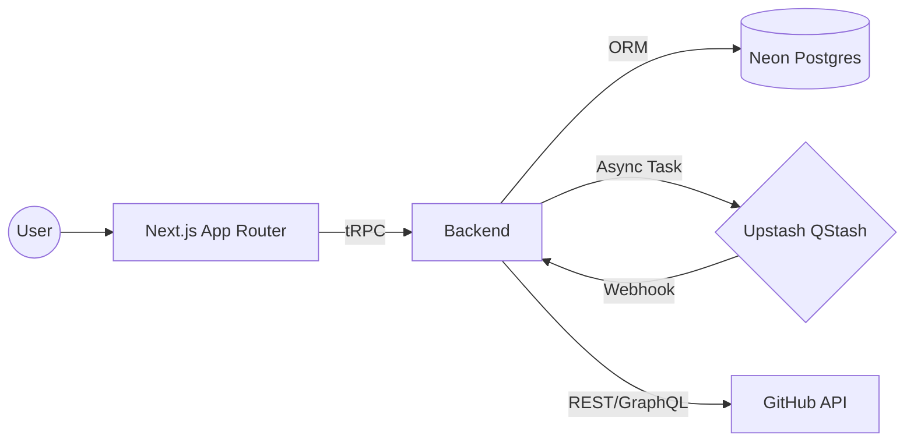

  # Doxynix Intelligence

  **Next-Gen Repository Analysis & Documentation Engine**
  
  
  
  
  

  

    <b>Analyze. Understand. Document.</b> 
    A serverless-first platform for automated code analysis,  
    built on event-driven microservice patterns.
  

---

### ⚡ Tech Stack

We utilize a cutting-edge **2026** stack to ensure maximum performance, fault tolerance, and developer experience.

| Domain | Technologies |
| :--- | :--- |
| **Frontend Core** |    |
| **UI & UX** |    |
| **Backend & API** |    |
| **Data & Queue** |    |
| **Quality Gate** |    |

---

### 🏗 Architecture

The system follows **Feature-Sliced Design (Simplified)** principles for scalability and maintainability.

### 🚀 Key Features

-   **End-to-End Type Safety**: Complete type safety from database to UI components via **tRPC + Prisma + ZenStack**.
-   **Serverless First**: Zero-maintenance scaling with **Neon** (Postgres) and **Upstash** (Queues).
-   **Async Processing**: Heavy analysis tasks are offloaded to background workers via **QStash** for non-blocking UX.
-   **Enterprise Security**:
    -   🔐 **NextAuth** with GitHub OAuth provider.
    -   🛡️ **ZenStack** for declarative Access Control Policies (RBAC/ABAC).
    -   🧪 **Mutation Testing** ensures high reliability of the test suite.

   
  Built with ❤️ by the Doxynix Team.

